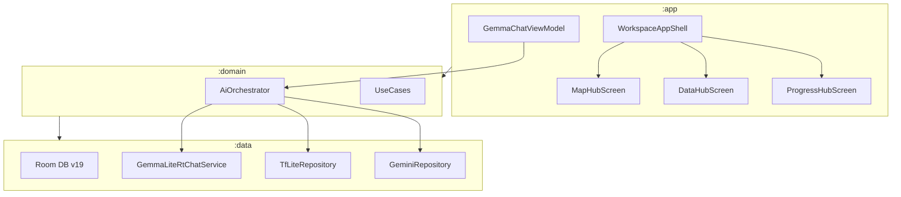
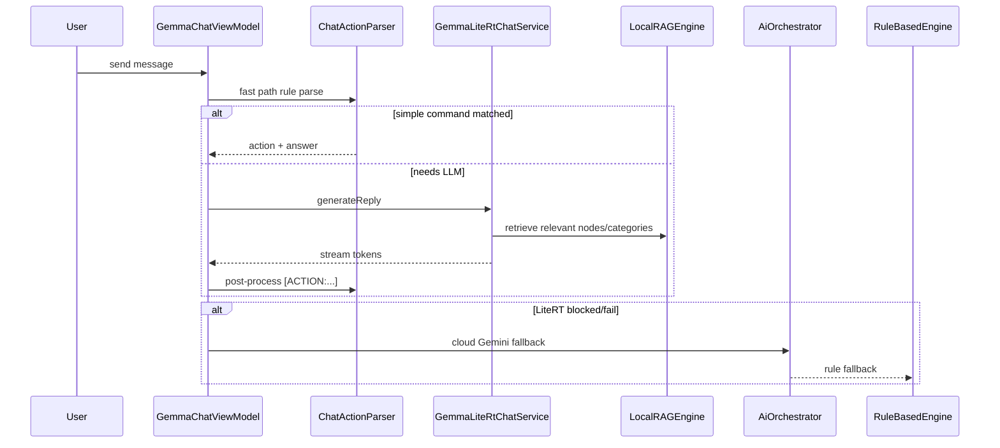
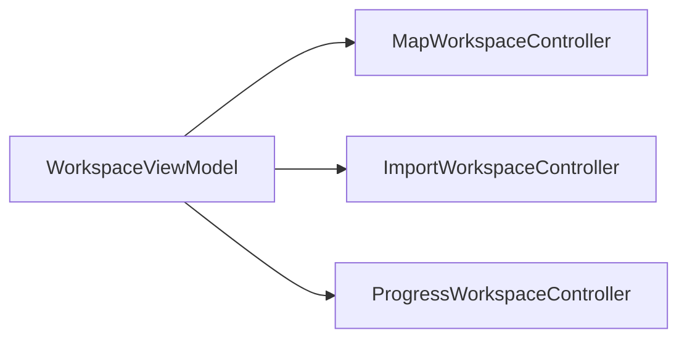

# Kế hoạch tối ưu MAPSUPERVISION-NonAuth

## 1. Tổng quan dự án

**MapSupervision** là ứng dụng Android giám sát thực địa (offline-first) cho hạ tầng viễn thông/GIS, phiên bản **NonAuth** (không auth, MapLibre thay Google Maps).



| Tab | Màn hình | Vai trò |
|-----|----------|---------|
| Bản đồ | [MapHubScreen.kt](app/src/main/java/com/mapsupervision/app/workspace/MapHubScreen.kt) | GIS MapLibre, chọn node/route, camera, ghi chú |
| Tiến độ | [ProgressHubScreen.kt](app/src/main/java/com/mapsupervision/app/workspace/ProgressHubScreen.kt) | KPI, critical path, nhật ký, PDF |
| Nhập liệu | [DataHubScreen.kt](app/src/main/java/com/mapsupervision/app/workspace/DataHubScreen.kt) | Import Excel/KML, gallery ảnh, mapping |
| Báo cáo | [ReportingScreen.kt](reporting/src/main/java/com/mapsupervision/reporting/ui/ReportingScreen.kt) | Xuất PDF/DOCX |

**Stack:** Kotlin 2.2, Compose, Hilt, Room, MapLibre 11.7, LiteRT LM 0.10.2, TFLite, ML Kit (stub), Gemini cloud fallback.

**Tài liệu tham chiếu:** [docs/MAPSUPERVISION_Analysis_Report.md](docs/MAPSUPERVISION_Analysis_Report.md), [.kiro/specs/app-performance-optimization/](.kiro/specs/app-performance-optimization/), [docs/AI_Plan.md](docs/AI_Plan.md).

---

## 2. Đánh giá lỗi hiện tại và phương án khắc phục

### 2.1 Lỗi nghiêm trọng (Sprint 1 — tuần 1)

| ID | Vấn đề | Vị trí | Hậu quả | Khắc phục |
|----|--------|--------|---------|-----------|
| **C-01** | Single-tap chọn file luôn set `null` | [DataHubScreen.kt:538](app/src/main/java/com/mapsupervision/app/workspace/DataHubScreen.kt) | Không thể chọn file bằng tap | Sửa thành `selectedFile = if (isSelected) null else file` |
| **C-02** | `GemmaChatController` luôn `ready = true` sau init | [GemmaChatController.kt:38-44](data/src/main/java/com/mapsupervision/data/mediapipe/GemmaChatController.kt) | UI báo sẵn sàng khi engine thực tế lỗi | Bọc `initializeModel()` trong `runCatching`; `ready = initResult.success`; reset `initializedModelId` khi fail |
| **C-03** | Filter node/route trên main thread mỗi recomposition | [WorkspaceAppShell.kt:313-314](app/src/main/java/com/mapsupervision/app/WorkspaceAppShell.kt) gọi `getFilteredDesignNodesForMap()` | Freeze/ANR khi 500+ node, mỗi keystroke search | Thêm `filteredNodesForMap` / `filteredRoutes` `StateFlow` + `flowOn(Dispatchers.Default)` theo spec [.kiro/specs/app-performance-optimization/design.md](.kiro/specs/app-performance-optimization/design.md) |
| **C-04** | `buildDashboard()` chạy sync trong `applySnapshot()` | [WorkspaceViewModel.kt:188-193](app/src/main/java/com/mapsupervision/app/workspace/WorkspaceViewModel.kt) | Jank khi snapshot lớn | Offload `buildDashboard` sang `Dispatchers.Default` trước khi `_state.value = ...` |

### 2.2 Lỗi trung bình (Sprint 1 — tuần 2)

| ID | Vấn đề | Vị trí | Khắc phục |
|----|--------|--------|-----------|
| **M-01** | `onGloballyPositioned` cập nhật `fileBounds` → recomposition loop | DataHubScreen.kt:530-532 | Debounce hoặc cache bounds chỉ khi drag active |
| **M-02** | Haversine distance tính trong mỗi grid item | DataHubScreen.kt:810-825 | Precompute `Map<String, Double>` distance một lần bằng `remember(nodes, routes)` |
| **M-03** | `remember { mutableStateOf }` trong `LazyRow` item | DataHubScreen.kt:653 | Đưa state ra ngoài item, keyed theo `file.id` |
| **M-04** | `AIManager` collector WorkManager không cancel | [AIManager.kt:94-119](app/src/main/java/com/mapsupervision/app/ai/AIManager.kt) | Lưu `Job`, `cancel()` trước dispatch mới |
| **M-05** | `InputStream` không đóng | MlKitScannerService.kt:141-145 | Dùng `.use {}` |
| **M-06** | `aiOrchestrator.execute()` trong `runAiOpsRecommendations` thiếu IO context | WorkspaceViewModel.kt:239-250 | `withContext(Dispatchers.IO)` |

**Đã cải thiện một phần:** `flushThreshold` import đã giảm từ 2000 → 750 trong [WorkspaceImportActions.kt:225](app/src/main/java/com/mapsupervision/app/workspace/WorkspaceImportActions.kt).

### 2.3 Lỗi kiến trúc / build (Sprint 2 hoặc song song)

| ID | Vấn đề | Khắc phục |
|----|--------|-----------|
| **A-01** | ML Kit OCR/barcode stub — engine throw `NotImplementedError` | Hoàn thiện `MlKitScannerService` hoặc tắt capability trong `AiOrchestrator` feature flags |
| **A-02** | MediaPipe LLM stub, dependency commented | Quyết định: **bỏ hẳn** (LiteRT đã thay thế) hoặc enable sau — tránh đăng ký engine dead trong orchestrator |
| **A-03** | Module `:timeline` + `DashboardHubScreen` không dùng | Xóa dependency hoặc wire navigation |
| **A-04** | `WorkspaceViewModel` god object (~1300 dòng extensions) | Refactor Sprint 2 (mục 5) |
| **A-05** | Dual DB (global + per-project) | Document rõ contract; audit query scoping |
| **A-06** | `android.suppressUnsupportedCompileSdk=35` | AGP đã 8.10 — thử xóa suppress và verify build |

### 2.4 Lỗi đã có test/regression guard

- Filter map KML empty: [KmlMapNodeCodesTest.kt](app/src/test/java/com/mapsupervision/app/workspace/KmlMapNodeCodesTest.kt) — giữ test khi đổi filter logic.
- AI parsing: [ChatActionParserTest.kt](domain/src/test/java/com/mapsupervision/domain/ai/ChatActionParserTest.kt), [LocalAiOptimizationsTest.kt](domain/src/test/java/com/mapsupervision/domain/ai/LocalAiOptimizationsTest.kt).

---

## 3. Phương án tối ưu AI local hoạt động chính xác

### 3.1 Hiện trạng pipeline AI



**Engine thực tế hoạt động:** LiteRT (Qwen3 0.6B / Gemma variants), RuleBased, TFLite vision, Gemini cloud. **Không hoạt động:** MediaPipe LLM, ML Kit vision.

### 3.2 Nguyên nhân AI local kém chính xác

1. **Context quá dài / nhiễu:** `CONTEXT_CHAR_LIMIT = 1500` nhưng chưa luôn dùng RAG trước khi build prompt.
2. **Post-processing yếu:** LLM trả text tự do; `ChatActionParser` phải extract `[ACTION:...]` — dễ miss khi model nhỏ.
3. **Init không tin cậy:** C-02 khiến UI/chat tiếp tục khi engine chưa load.
4. **HeavyAIWorker mất context:** [HeavyAIWorker.kt](app/src/main/java/com/mapsupervision/app/ai/workers/HeavyAIWorker.kt) dùng history rỗng.
5. **Safety gate quá cứng:** [LiteRtSafetyGate.kt](domain/src/main/java/com/mapsupervision/domain/ai/LiteRtSafetyGate.kt) chặn khi pin < 20% và không sạc — đúng cho pin nhưng cần UX rõ "đang dùng rule-based".
6. **Fuzzy match chưa wired đầy đủ:** `PostProcessorMapping` + `LocalRAGEngine` có test nhưng cần verify được gọi trong `GemmaLiteRtChatService` system prompt.

### 3.3 Phương án tối ưu AI local (Sprint 2)

**Phase A — Độ tin cậy inference**

- Sửa C-02: `InitializationResult` phản ánh trạng thái engine thật.
- Trong [GemmaLiteRtChatService.kt](data/src/main/java/com/mapsupervision/data/mediapipe/GemmaLiteRtChatService.kt): luôn inject RAG context (`LocalRAGEngine.buildContextString`) thay vì dump toàn bộ nodes.
- Giảm `temperature` / `topK` cho action commands (deterministic parsing).
- Structured output: system prompt bắt buộc format `[ACTION:type|field=value]` + ví dụ few-shot tiếng Việt (3-5 mẫu theo tab Map/Progress/Data).

**Phase B — Hybrid routing thông minh**

- Mở rộng fast path trong [GemmaChatViewModel.kt](app/src/main/java/com/mapsupervision/app/workspace/GemmaChatViewModel.kt): mọi lệnh có pattern rõ (cập nhật tiến độ, ghi nhật ký, chọn node) → `ChatActionParser` trước, **không** gọi LLM.
- Chỉ gọi LiteRT cho: tóm tắt, gợi ý báo cáo, câu hỏi mở.
- Hiển thị badge UI: `Local AI` / `Rule` / `Cloud` theo `AiDecision.source`.

**Phase C — Post-processing chính xác**

- Sau LLM response: pipeline `CanonicalTextNormalizer` → `ChatActionParser` → `PostProcessorMapping.findClosestNode/Category` (Levenshtein đã có test).
- Reject action nếu confidence fuzzy match < threshold; hỏi lại user thay vì ghi DB sai.

**Phase D — Model & resource**

- Mặc định Qwen3 0.6B INT4 trên thiết bị < 6GB RAM; Gemma E2B chỉ khi user chọn + Wi-Fi.
- Warm-up model khi mở chat (`warmUpSelectedModel`) — giữ nhưng thêm timeout + error surface.
- `HeavyAIWorker`: truyền `CHAT_HISTORY_LIMIT` messages qua `Data` input.

**Phase E — ML Kit / TFLite (tùy chọn sau LiteRT ổn)**

- OCR cho nhãn vật tư trong `PhotoPipelineService` — ưu tiên hơn MediaPipe LLM.
- `PHOTO_QUALITY_CHECK` dùng TFLite assets hiện có.

**Tiêu chí đo lường AI:**

| Metric | Mục tiêu |
|--------|----------|
| Action parse accuracy (test set 50 câu VI) | >= 90% với rule path, >= 75% với LiteRT |
| Init success rate | 100% reflected in UI (`chatReady`) |
| P95 inference latency (0.6B) | < 8s first token trên mid-range device |
| Wrong node/category binding | 0 sau fuzzy gate |

---

## 4. Kế hoạch tối ưu ứng dụng mượt mà (Performance)

### Sprint 1 — Hot path (theo [.kiro/specs/app-performance-optimization/tasks.md](.kiro/specs/app-performance-optimization/tasks.md))

**4.1 Map tab — loại bỏ main-thread filter**

```kotlin
// WorkspaceViewModel.kt — pattern đề xuất
val filteredNodesForMap: StateFlow<List<GisNode>> = _state
    .map { state -> filterNodes(state.designNodes, state.mapUi) }
    .flowOn(Dispatchers.Default)
    .stateIn(viewModelScope, SharingStarted.WhileSubscribed(5_000), emptyList())
```

- Cập nhật [WorkspaceAppShell.kt](app/src/main/java/com/mapsupervision/app/WorkspaceAppShell.kt) dùng `collectAsStateWithLifecycle()`.
- Property test: kết quả filter giống hệt `getFilteredDesignNodes()` (spec Property 4).

**4.2 Snapshot / dashboard offload**

- `applySnapshot`: `withContext(Default) { buildDashboard(...) }` trước emit state.
- `addConstructionProgress` / `updateMaterialProgress`: tương tự (spec Property 2).

**4.3 DataHub grid**

- Precompute sorted/filtered list trong ViewModel (`DataHubViewModel`), không filter trong Composable body.
- Pagination hoặc `Paging 3` nếu > 200 design objects.
- Fix C-01, M-01, M-02, M-03.

**4.4 Map rendering**

- Giữ debounced `mapUpdateJob` trong MapBridge (đã có).
- Review `LaunchedEffect` auto `fitToObjects()` [MapHubScreen.kt:208-220](app/src/main/java/com/mapsupervision/app/workspace/MapHubScreen.kt) — chỉ chạy khi project/import thay đổi, không khi selection đổi.

**4.5 Compose state hygiene**

- Tách `WorkspaceState` monolith thành flows riêng cho `mapUi`, `importUi`, `dashboard` (giảm recomposition phạm vi) — bước đầu trong Sprint 1, hoàn thiện Sprint 2.
- Thay `collectAsState().value` inline bằng `by collectAsStateWithLifecycle()`.

**4.6 Memory / import**

- Giữ `flushThreshold = 750`; thêm time-based flush mỗi 300ms khi import batch lớn.
- `onTrimMemory` trong Application — đã có; bổ sung clear AI cache khi `TRIM_MEMORY_RUNNING_CRITICAL`.

**Tiêu chí performance:**

| Scenario | Mục tiêu |
|----------|----------|
| Map 500 nodes, gõ search | Không drop frame > 2 liên tiếp |
| Mở tab Map cold | < 500ms đến first paint |
| Import 2000 nodes | Không ANR; peak RAM < 80% available |
| Scroll DataHub grid 100 items | 60fps trên mid device |

---

## 5. Phương án refactor code

### 5.1 Mục tiêu

Giảm god files, tăng testability, giữ behavior unchanged (preservation requirements từ performance spec).

### 5.2 Tách WorkspaceViewModel (ưu tiên cao)

Hiện tại logic trải trên 4 file extension:

| File hiện tại | ~Dòng | Đề xuất tách thành |
|---------------|-------|-------------------|
| [WorkspaceMapProgressActions.kt](app/src/main/java/com/mapsupervision/app/workspace/WorkspaceMapProgressActions.kt) | 1300+ | `MapWorkspaceController`, `ProgressWorkspaceController`, `PhotoWorkspaceController` |
| [WorkspaceImportActions.kt](app/src/main/java/com/mapsupervision/app/workspace/WorkspaceImportActions.kt) | — | `ImportWorkspaceController` |
| [WorkspaceImportMappingActions.kt](app/src/main/java/com/mapsupervision/app/workspace/WorkspaceImportMappingActions.kt) | — | `ImportMappingController` |
| [WorkspaceViewModel.kt](app/src/main/java/com/mapsupervision/app/workspace/WorkspaceViewModel.kt) | 335 | Orchestrator mỏng: delegate + expose StateFlows |

**Pattern:** Controller classes inject repositories/use cases; ViewModel chỉ forward actions và merge state.



### 5.3 Tách Hub Composables (ưu tiên trung bình)

Mỗi hub ~1000 dòng → tách theo section:

- **MapHub:** `MapCanvas`, `MapNodeCard`, `MapToolbar`, `MapProjectDialogs`
- **DataHub:** `ImportFileRow`, `DesignObjectGrid`, `ExcelMappingSheet`
- **ProgressHub:** `ProgressDashboard`, `DailyLogForm`, `CriticalPathList`

Giảm parameter list bằng **state holder data class** + event sealed interface thay vì 50+ lambda.

### 5.4 Dọn module chết

- Gỡ `:timeline` khỏi [app/build.gradle.kts](app/build.gradle.kts) hoặc integrate vào Progress tab.
- Xóa / wire [DashboardHubScreen.kt](app/src/main/java/com/mapsupervision/app/workspace/DashboardHubScreen.kt).
- Consolidate camera: `CameraOverlay` (:app) vs `PhotoScreen` (:photo).

### 5.5 AI layer cleanup

- Remove `MediaPipeLlmEngine` khỏi default engine list nếu không triển khai trong 2 sprint.
- Single source of truth: `ChatDictionaryResolver` — hiện có bản domain + app; merge về domain.

### 5.6 Thứ tự refactor an toàn

1. Extract pure functions (filter, dashboard) → unit test trước khi move.
2. Extract controllers từ extensions (mechanical move, không đổi logic).
3. Split Composables (UI only, không đổi state contract).
4. Slim `WorkspaceState` — cuối cùng vì impact rộng nhất.

---

## 6. Lộ trình triển khai (Balanced — 2 sprint)

### Sprint 1 (tuần 1-2): Lỗi nghiêm trọng + Performance nóng

1. Fix C-01 DataHub tap selection
2. Implement `filteredNodesForMap` / `filteredRoutes` StateFlow + update WorkspaceAppShell
3. Offload `buildDashboard` trong `applySnapshot` và progress mutations
4. Fix C-02 GemmaChatController init truthfulness
5. DataHub perf: precompute distances, fix LazyRow state, debounce fileBounds
6. Fix AIManager collector leak (M-04)
7. Viết regression tests: filter preservation, init failure path
8. Verify: manual test map 500+ nodes, search keystroke, import batch

### Sprint 2 (tuần 3-4): AI local + Refactor

1. RAG-first prompt trong GemmaLiteRtChatService
2. Expand ChatActionParser fast path + fuzzy post-processing gate
3. UI source badge + safety gate messaging
4. HeavyAIWorker history fix
5. Disable/remove dead AI engines (MediaPipe, ML Kit flags)
6. Extract Map/Import/Progress controllers từ WorkspaceViewModel extensions
7. Split MapHubScreen / DataHubScreen thành sub-composables
8. Module cleanup (:timeline, DashboardHubScreen)
9. Expand AI test suite: 50 Vietnamese command fixtures

---

## 7. Rủi ro và giảm thiểu

| Rủi ro | Giảm thiểu |
|--------|------------|
| Filter StateFlow khác kết quả cũ | Property test so sánh với `getFilteredDesignNodes()` |
| Refactor break import/map | Chạy existing tests + manual KML import scenario |
| LiteRT vẫn chậm trên máy yếu | Rule-first routing; model 0.6B default |
| Scope creep refactor | Chỉ mechanical extract sprint 2; không redesign state model |

---

## 8. Files then chốt cần sửa

**Sprint 1:**
- [DataHubScreen.kt](app/src/main/java/com/mapsupervision/app/workspace/DataHubScreen.kt)
- [WorkspaceViewModel.kt](app/src/main/java/com/mapsupervision/app/workspace/WorkspaceViewModel.kt)
- [WorkspaceAppShell.kt](app/src/main/java/com/mapsupervision/app/WorkspaceAppShell.kt)
- [WorkspaceMapProgressActions.kt](app/src/main/java/com/mapsupervision/app/workspace/WorkspaceMapProgressActions.kt)
- [GemmaChatController.kt](data/src/main/java/com/mapsupervision/data/mediapipe/GemmaChatController.kt)
- [AIManager.kt](app/src/main/java/com/mapsupervision/app/ai/AIManager.kt)

**Sprint 2:**
- [GemmaLiteRtChatService.kt](data/src/main/java/com/mapsupervision/data/mediapipe/GemmaLiteRtChatService.kt)
- [GemmaChatViewModel.kt](app/src/main/java/com/mapsupervision/app/workspace/GemmaChatViewModel.kt)
- [AiOrchestrator.kt](domain/src/main/java/com/mapsupervision/domain/ai/AiOrchestrator.kt)
- Hub screens + new controller classes under `app/.../workspace/controllers/`
