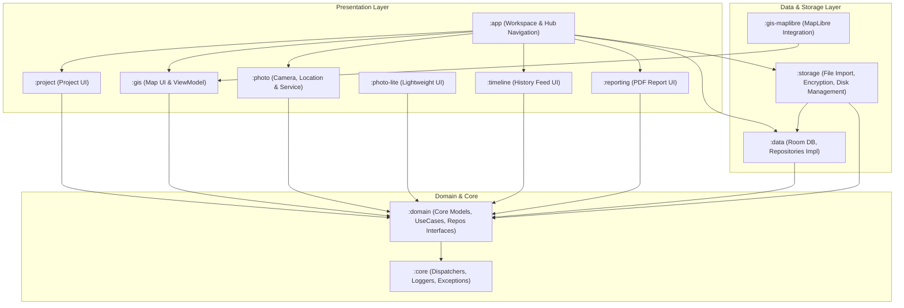
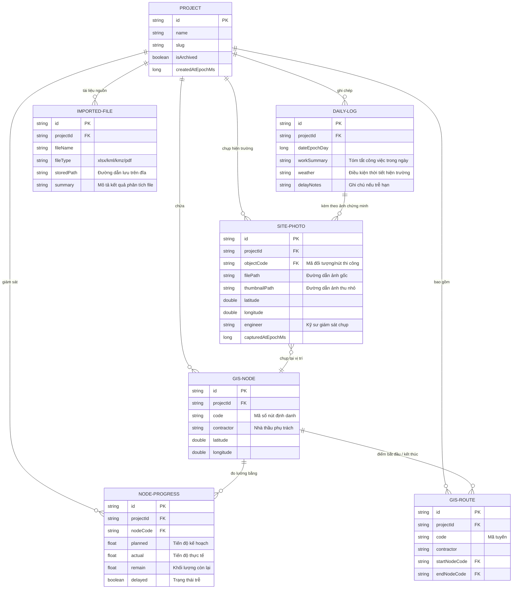

# Tài Liệu Tổng Quan Dự Án MapSupervision

Chào mừng bạn đến với tài liệu kỹ thuật chi tiết của hệ thống **MapSupervision** (Hệ Thống Giám Sát Dự Án Trên Bản Đồ Số). Đây là một ứng dụng Android đa mô-đun (Multi-module Android Application) hiện đại, áp dụng Kiến Trúc Sạch (Clean Architecture) kết hợp với Jetpack Compose để quản lý và giám sát tiến độ thi công hạ tầng, ghi nhận hiện trường thông qua GIS và hình ảnh định vị GPS.

---

## 1. Tính Năng Dự Án (Project Features)

MapSupervision được xây dựng với mục tiêu cung cấp giải pháp toàn diện cho các kỹ sư giám sát dự án hạ tầng lớn (đường ống, đường dây, trạm biến áp, v.v.). Các tính năng chính bao gồm:

### 1.1. Quản Lý Không Gian Làm Việc & Dự Án (Workspace & Project Management)
- **Tạo và chuyển đổi linh hoạt giữa nhiều dự án**: Mỗi dự án có một thư mục lưu trữ độc lập trên thiết bị.
- **Phân tách dữ liệu an toàn**: Tạo cấu trúc lưu trữ biệt lập cho từng dự án (`db`, `photos`, `thumbs`, `reports`, `exports`, `imports`).
- **Mã hóa và đóng gói**: Hỗ trợ xuất/nhập gói dữ liệu dự án, bảo vệ thông tin thông qua cơ chế mã hóa.

### 1.2. Bản Đồ Giám Sát GIS (Geographical Information System Map)
- **Tích hợp bản đồ số chất lượng cao**: Sử dụng công nghệ MapLibre GL (`gis-maplibre`) hỗ trợ render bản đồ vectơ mượt mà.
- **Trực quan hóa mạng lưới hạ tầng**: Hiển thị các nút kỹ thuật (**GisNode**) và các tuyến kết nối (**GisRoute**) trực tiếp trên bản đồ.
- **Tùy biến giao diện (Style Builder)**: Tự động phân cấp màu sắc, độ dày nét vẽ dựa trên trạng thái thi công và nhà thầu.

### 1.3. Nhập Dữ Liệu Tự Động Từ File Người Dùng (Smart Data Importer)
- **Hỗ trợ định dạng không gian**: Phân tích cú pháp file **KML / KMZ** để tự động trích xuất danh sách các điểm nút (`GisNode`) và tuyến (`GisRoute`) mà không cần kết nối mạng.
- **Trích xuất thông tin tài liệu**:
  - **Excel (.xlsx, .xls)**: Đọc cấu trúc bảng tính, thống kê số lượng sheet và dữ liệu tiến độ.
  - **Word (.docx, .doc)**: Đếm và kiểm tra cấu trúc tài liệu thi công.
  - **PDF (.pdf)**: Đọc siêu dữ liệu, ước tính số trang tài liệu thiết kế.

### 1.4. Quản Lý Tiến Độ Thi Công Chi Tiết (Node Progress Tracking)
- **Cập nhật tiến độ thời gian thực**: Theo dõi các chỉ số `planned` (kế hoạch), `actual` (thực tế), và `remain` (còn lại) cho từng nút mạng lưới.
- **Cảnh báo chậm trễ**: Tự động đánh dấu cờ `delayed` khi tiến độ thực tế không đạt kế hoạch để kỹ sư có phương án xử lý kịp thời.

### 1.5. Giám Sát Hiện Trường Bằng Hình Ảnh (GPS Field Photo Tracking)
- **Chụp ảnh định vị thông minh**: Tích hợp camera chụp ảnh hiện trường tự động gán tọa độ GPS (`latitude`, `longitude`), tên kỹ sư giám sát và mốc thời gian.
- **Xử lý ảnh nền (Background Processing)**: Sử dụng WorkManager (`PhotoPipelineService`) thực hiện các tác vụ nặng như mã hóa ảnh, giảm dung lượng và tự động sinh ảnh thu nhỏ (thumbnail) nhằm tối ưu hiệu năng.

### 1.6. Nhật Ký Tiến Độ & Báo Cáo (Daily Log & PDF Reporting)
- **Bảng dòng thời gian (Timeline UI)**: Xem toàn bộ lịch sử thi công, nhật ký cập nhật và hình ảnh hiện trường được sắp xếp theo thời gian thực tế.
- **Tự động xuất báo cáo PDF**: Tạo tệp báo cáo PDF (`PdfReportGenerator`) chuyên nghiệp chứa đầy đủ nhật ký ngày, ảnh chụp thực tế và biểu đồ tiến độ để gửi trực tiếp cho chủ đầu tư.

---

## 2. Cấu Trúc Thư Mục & Thiết Kế Kiến Trúc (Architecture & Directory Structure)

Dự án áp dụng mô hình **Clean Architecture** chia nhỏ thành các Gradle module độc lập giúp tăng tốc độ build, dễ viết Unit Test và tăng tính tái sử dụng.

### Sơ Đồ Cấu Trúc Module Tổng Quát:

### Chi Tiết Từng Module & Chức Năng:

#### 1. `:core` (Hạ tầng dùng chung)
- **Chức năng**: Cung cấp các công cụ nền tảng không phụ thuộc vào Android.
- **Các thành phần chính**:
  - `DispatcherProvider.kt`: Quản lý luồng Coroutines (IO, Default, Main) hỗ trợ viết Unit Test.
  - `AppExceptions.kt`: Định nghĩa các lỗi hệ thống chuẩn hóa.
  - `AppLogger.kt`: Ghi log toàn hệ thống.
  - `AppResult.kt`: Lớp đóng gói dữ liệu thành công/thất bại thống nhất.

#### 2. `:domain` (Nghiệp vụ cốt lõi)
- **Chức năng**: Chứa thực thể nghiệp vụ (Entities) và luật nghiệp vụ (Rules). Hoàn toàn thuần Kotlin độc lập với UI và Database.
- **Các thành phần chính**:
  - **Models**: `Project`, `GisNode`, `GisRoute`, `NodeProgress`, `SitePhoto`, `DailyLog`, `ImportedFile`.
  - **Repositories (Interfaces)**: Khai báo giao thức kết nối dữ liệu (ví dụ: `ProjectRepository`, `GisRepository`, `PhotoRepository`).
  - **UseCases**: Quy trình nghiệp vụ độc lập (ví dụ: `CreateProjectUseCase.kt`).

#### 3. `:data` (Cơ sở dữ liệu & Triển khai Repository)
- **Chức năng**: Lưu trữ dữ liệu SQLite cục bộ thông qua Room Database và hiện thực hóa các Repository từ `:domain`.
- **Các thành phần chính**:
  - `MapSupervisionDatabase.kt`: Điểm cấu hình Room DB chính.
  - `dao/`: Chứa các Data Access Objects (`ProjectDao`, `GisNodeDao`, `GisRouteDao`, `SitePhotoDao`, `NodeProgressDao`).
  - `entity/`: Các thực thể lưu trữ ánh xạ 1:1 với SQLite DB.
  - `repository/`: Triển khai chi tiết các giao thức của Domain (ví dụ: `ProjectRepositoryImpl.kt`, `GisRepositoryImpl.kt`).

#### 4. `:storage` (Quản lý File, Nhập Liệu & Bảo Mật)
- **Chức năng**: Xử lý đĩa vật lý, giải mã/mã hóa tệp tin và đọc cấu trúc các định dạng file đính kèm.
- **Các thành phần chính**:
  - `ProjectStorageManager.kt`: Quản lý cấu trúc thư mục dự án trên bộ nhớ cục bộ.
  - `importer/UserFileImportService.kt`: Công cụ phân tích cú pháp **KML/KMZ**, Excel, Word và PDF để chuyển đổi thành cấu trúc GIS thực tế.
  - `crypto/ProjectCryptoManager.kt`: Mã hóa dữ liệu dự án nhạy cảm trước khi chia sẻ hoặc đồng bộ.

#### 5. `:gis` & `:gis-maplibre` (Bản đồ số & Trực quan không gian)
- **Chức năng**: Render hệ thống hạ tầng lên bản đồ tương tác và quản lý trạng thái tương tác không gian.
- **Các thành phần chính**:
  - `GisScreen.kt` & `GisViewModel.kt`: Giao diện Jetpack Compose điều khiển lớp bản đồ và hiển thị thông tin khi người dùng chạm vào các nút/tuyến.
  - `GisStyleBuilder.kt`: Tạo style động cho bản đồ.
  - `MapBridgeInstaller.kt` (ở `:gis-maplibre`): Cầu nối tích hợp thư viện MapLibre native vào hệ thống Compose Android.

#### 6. `:photo` & `:photo-lite` (Chụp ảnh & Xử lý bất đồng bộ hiện trường)
- **Chức năng**: Điều khiển thiết bị camera, thu thập GPS có độ chính xác cao và nén xử lý ảnh nền.
- **Các thành phần chính**:
  - `PhotoLocationProvider.kt`: Cung cấp tọa độ chính xác thời gian thực cho bức ảnh.
  - `PhotoPipelineService.kt`: WorkManager xử lý lưu tệp, tạo thumbnail chất lượng tốt ở chế độ chạy ngầm để không gây giật lag UI.
  - `PhotoScreen.kt` & `PhotoViewModel.kt`: Giao diện xem và chụp ảnh gắn thẻ kỹ sư, thời gian.

#### 7. `:timeline` (Dòng thời gian thi công)
- **Chức năng**: Cung cấp cái nhìn lịch sử toàn diện về mọi cập nhật trên dự án.
- **Các thành phần chính**:
  - `TimelineScreen.kt`: Giao diện danh sách dòng thời gian trực quan, hiển thị các mốc thay đổi trạng thái, ảnh vừa chụp theo dạng timeline chuẩn.

#### 8. `:reporting` (Xuất báo cáo PDF)
- **Chức năng**: Biên tập và xuất ra các văn bản PDF chính thức.
- **Các thành phần chính**:
  - `PdfReportGenerator.kt`: Định dạng và vẽ báo cáo ra file PDF (sử dụng thư viện vẽ Canvas/PDF trên Android).
  - `ReportingScreen.kt`: Quản lý danh sách báo cáo đã xuất, tùy chọn khoảng thời gian cần xuất.

#### 9. `:app` (Trạm điều hướng trung tâm)
- **Chức năng**: Module chạy chính, cấu hình DI (Dagger Hilt), kết nối điều hướng giữa các Module khác.
- **Các thành phần chính**:
  - `MainActivity.kt`: Điểm khởi đầu ứng dụng Android chứa NavHost của Compose.
  - `workspace/`: Dashboard chính gồm `DashboardHubScreen`, `DataHubScreen`, `MapHubScreen` đóng vai trò giao diện trung tâm kết nối các phân hệ.

---

## 3. Bản Đồ Tri Thức Dự Án (Knowledge Graph)

Dưới đây là sơ đồ tương quan thực thể dữ liệu (Data Relationship & Entity-Relation Map) mô tả luồng liên kết nghiệp vụ trong hệ thống MapSupervision:

### Giải Thích Luồng Dữ Liệu Nghiệp Vụ Chính:
1. **Nhập Hạ Tầng Đầu Vào**: Người dùng nhập file `KML` thông qua `UserFileImportService`. Hệ thống phân tích tọa độ sinh ra các đối tượng `GisNode` và `GisRoute` liên kết chéo với nhau thông qua `startNodeCode` và `endNodeCode`.
2. **Cập Nhật Tiến Độ & Giám Sát**: Hằng ngày, kỹ sư hiện trường sử dụng phân hệ `:gis` để kiểm tra các vị trí nút hạ tầng. Họ tiến hành đo đạc tiến độ hiện thực của nút đó (`NodeProgress`) và chụp ảnh hiện thực (`SitePhoto`) thông qua module `:photo`. 
3. **Mã Hóa & Chạy Ngầm**: Ảnh hiện trường được `PhotoPipelineService` thu nhỏ lại để hiển thị mượt trên giao diện bản đồ, đồng thời gắn kèm định vị GPS chính xác của nút hạ tầng đó.
4. **Hợp Nhất Nhật Ký & Xuất Bản**: Toàn bộ tiến độ cập nhật và ảnh chứng minh được tổng hợp tự động vào bảng dòng thời gian `:timeline` và nhật ký ngày `DailyLog`. Khi cần, `:reporting` sẽ xuất các file PDF chứa báo cáo tiến độ trực quan được sắp xếp theo từng hạng mục gửi đi.

---
*Tài liệu này được biên soạn tự động để phản ánh kiến trúc hiện tại của dự án MapSupervision.*
