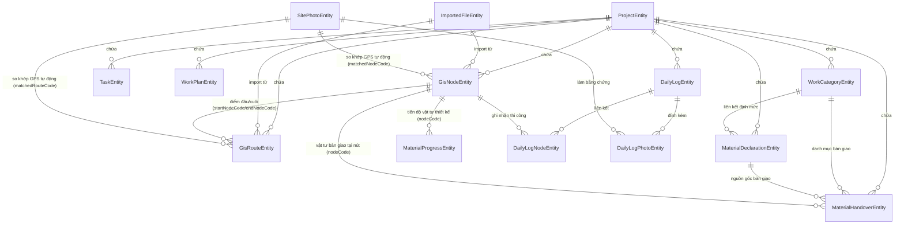

# SƠ ĐỒ MỐI QUAN HỆ & LUỒNG DỮ LIỆU DATABASE

Hệ thống **MapSupervision** sử dụng **Room Database** (SQLite) để quản lý toàn bộ dữ liệu dự án. Tài liệu này mô tả chi tiết cấu trúc thực thể (Entities), mối quan hệ dữ liệu (Relationships), và luồng dữ liệu (Data Flows) của các phân hệ chính: **Node (Điểm nút), Route (Tuyến cáp/Đường ống), Vật tư (Materials) và Công việc (Tasks/Daily Logs)**.

---

## 1. Sơ Đồ Quan Hệ Thực Thể (Entity Relationship Diagram)

Dưới đây là sơ đồ Mermaid mô tả các mối quan hệ khoá ngoại (Foreign Keys) và liên kết nghiệp vụ giữa các thực thể cốt lõi:



---

## 2. Chi Tiết Các Mối Quan Hệ Nghiệp Vụ

### 2.1. Phân Hệ Bản Đồ & Định Vị (Node & Route)
* **GisNodeEntity (`gis_node`)**: Đại diện cho các thực thể điểm như cột điện, hố ga, tủ cáp.
  - Liên kết với **ProjectEntity** qua `projectId` (NO_ACTION khi xóa dự án vì dự án được quản lý phân đoạn).
  - Liên kết với **ImportedFileEntity** qua `importedFileId` (SET_NULL khi file gốc bị xóa).
* **GisRouteEntity (`gis_route`)**: Tuyến đường ống hoặc cáp nối giữa các điểm nút.
  - Liên kết với **ProjectEntity** và **ImportedFileEntity** tương tự Node.
  - Liên kết logic với **GisNodeEntity** qua cặp khóa `(startNodeCode, endNodeCode)` và chỉ mục ID vật lý `(startNodeId, endNodeId)`.
* **Luồng dữ liệu**: Khi nhập bản vẽ thiết kế (KML/KMZ hoặc Excel), hệ thống sẽ tạo một bản ghi trong `imported_files`, sau đó trích xuất hàng loạt các Node và Route tương ứng để lưu vào `gis_node` và `gis_route`.

### 2.2. Phân Hệ Quản Lý Vật Tư (Materials)
* **MaterialDeclarationEntity (`material_declaration`)**: Khai báo nguồn gốc, chứng chỉ vật tư và tỷ lệ quy đổi (`ratio`) từ công việc thiết kế sang vật tư thực tế.
  - Liên kết bắt buộc với **ProjectEntity** (ON DELETE CASCADE) và **WorkCategoryEntity** (ON DELETE SET NULL) qua `workCategoryId`.
* **MaterialProgressEntity (`work_volume_progress`)**: Theo dõi tiến độ khối lượng chi tiết từng vật tư tại một điểm nút.
  - Liên kết với dự án qua `projectId` và định vị tại Node qua `nodeCode` / `nodeId`.
  - Giúp quản lý so sánh giữa khối lượng kế hoạch (`plannedQty`) và khối lượng thực tế đã thi công (`actualQty`).
* **MaterialHandoverEntity (`material_handover`)**: Biên bản giao nhận vật tư cho nhà thầu thi công tại công trường.
  - Liên kết tới **MaterialDeclarationEntity** (`materialDeclarationId`) để xác định chứng chỉ chất lượng nguồn gốc.
  - Liên kết tới **WorkCategoryEntity** (`workCategoryId`) để phân nhóm công việc sử dụng vật tư đó.
  - Định vị nơi bàn giao qua `nodeCode` / `nodeId`.

### 2.3. Phân Hệ Công Việc & Nhật Ký Thi Công (Work, Task & Logs)
* **WorkCategoryEntity (`work_categories`)**: Danh mục chuẩn các nhóm công việc trong dự án (ví dụ: đào móng, đặt ống, kéo cáp...).
* **TaskEntity (`task`)**: Đầu việc/nhiệm vụ cần thực hiện tại hiện trường.
  - Có thể gán trực tiếp cho một Node hoặc Route cụ thể bằng cách điền `objectNodeId` hoặc `objectRouteId`.
* **WorkPlanEntity (`work_plan`)**: Kế hoạch thi công chi tiết phân bổ theo ngày (`plannedDateEpochDay`) cho các đối tượng Node/Route.
* **DailyLogEntity (`daily_log`)**: Nhật ký thi công hàng ngày của kỹ sư giám sát (ghi chép số nhân công, nhiệt độ, thời tiết, ghi chú, khối lượng hoàn thành `volume`).
  - **DailyLogNodeEntity (`daily_log_nodes`)**: Bảng liên kết trung gian N-N kết nối một bản nhật ký ngày (`dailyLogId`) với nhiều điểm nút (`nodeId`) được thi công trong ngày đó.
  - **DailyLogPhotoEntity (`daily_log_photos`)**: Bảng trung gian N-N kết nối nhật ký ngày (`dailyLogId`) với các bức ảnh hiện trường (`photoId` -> `SitePhotoEntity`) chụp thực tế để đối chứng.

---

## 3. Luồng Dữ Liệu Đồng Bộ & Cập Nhật Tiến Độ (Data Flow Lifecycle)

```
[Import File Thiết Kế] 
       │
       ├──► Tạo các bản ghi Nút (gis_node) và Tuyến (gis_route)
       └──► Thiết lập tiến độ vật tư mặc định (work_volume_progress) với plannedQty
       
[Lập Kế Hoạch] 
       │
       └──► Tạo kế hoạch thi công (work_plan) & nhiệm vụ (task) cho Node/Route
       
[Khảo Sát Hiện Trường]
       │
       ├──► Chụp ảnh giám sát (site_photos)
       └──► Hệ thống tự động so khớp tọa độ GPS -> gắn matchedNodeCode / matchedRouteCode
       
[Nhật Ký Thi Công Hàng Ngày]
       │
       ├──► Kỹ sư ghi daily_log (Nhập khối lượng thực tế hoàn thành)
       ├──► Hệ thống liên kết danh sách Node đã làm (daily_log_nodes) & Ảnh đính kèm (daily_log_photos)
       └──► Tính toán & Cập nhật ngược lại:
                 ├──► Tăng actualQty trong work_volume_progress (Tiến độ vật tư)
                 └──► Cập nhật trạng thái hoàn thành node_progress & task liên quan
```

---

## 4. Bảng Tra Cứu Thực Thể Room Database (Schema Mapping)

| Entity Class | Table Name | Mục Đích Nghiệp Vụ | Quan Hệ Khoá Ngoại (FK) |
| :--- | :--- | :--- | :--- |
| `AiActionLogEntity` | `ai_action_log` | Nhật ký ghi lại các hành động, lệnh điều khiển hệ thống được AI dịch và thực hiện. | `projectId` &rarr; `projects` |
| `AiDecisionCacheEntity` | `ai_decision_cache` | Bộ nhớ đệm kết quả phân tích AI (mã băm payload → kết quả JSON) giúp tối ưu CPU và năng lượng. | `projectId` &rarr; `projects` |
| `ChatHistoryEntity` | `chat_history` | Lịch sử hội thoại của kỹ sư với trợ lý AI Gemma cục bộ tích hợp trong ứng dụng. | `projectId` &rarr; `projects` |
| `DailyLogEntity` | `daily_log` | Nhật ký thi công hàng ngày trên công trường, ghi nhận khối lượng thực tế, số lượng nhân công, thời tiết, và hình ảnh liên kết tại hiện trường. | `projectId` &rarr; `projects`, `nodeId` &rarr; `gis_node`, `routeId` &rarr; `gis_route` |
| `DailyLogNodeEntity` | `daily_log_nodes` | Bảng liên kết nhiều-nhiều giữa nhật ký thi công daily_log và các điểm nút gis_node để ghi nhận tiến độ chi tiết. | `projectId` &rarr; `projects`, `dailyLogId` &rarr; `daily_log`, `nodeId` &rarr; `gis_node` |
| `DailyLogPhotoEntity` | `daily_log_photos` | Bảng liên kết nhiều-nhiều giữa nhật ký thi công daily_log và ảnh site_photos chụp tại hiện trường. | `projectId` &rarr; `projects`, `dailyLogId` &rarr; `daily_log`, `photoId` &rarr; `site_photos` |
| `EventOutboxEntity` | `event_outbox` | Bảng lưu trữ sự kiện nghiệp vụ tạm thời (Outbox pattern) phục vụ đồng bộ dữ liệu giữa thiết bị cục bộ và máy chủ. | Không có |
| `GisNodeEntity` | `gis_node` | Lưu trữ thông tin chi tiết và tọa độ các điểm nút GIS (như cột điện, hố ga, tủ cáp) trên bản đồ giám sát thi công. | `projectId` &rarr; `projects`, `importedFileId` &rarr; `imported_files` |
| `GisRouteEntity` | `gis_route` | Các tuyến đường/đoạn cáp nối giữa các điểm nút GIS, bao gồm danh sách tọa độ các điểm uốn dọc tuyến và chiều dài thiết kế. | `projectId` &rarr; `projects`, `importedFileId` &rarr; `imported_files`, `startNodeId` &rarr; `gis_node`, `endNodeId` &rarr; `gis_node` |
| `ImportAuditEntity` | `import_audit` | Nhật ký kiểm toán ghi lại các hoạt động, thao tác trong quy trình nhập liệu dữ liệu bản đồ thiết kế. | `projectId` &rarr; `projects`, `importSessionId` &rarr; `import_session` |
| `ImportConflictEntity` | `import_conflict` | Lưu trữ và xử lý các xung đột dữ liệu bản vẽ phát sinh khi có phiên bản thiết kế mới. | `projectId` &rarr; `projects`, `importSessionId` &rarr; `import_session` |
| `ImportSessionEntity` | `import_session` | Quản lý thông tin phiên nhập bản vẽ/dữ liệu thiết kế (import session) từ KML/Excel. | `projectId` &rarr; `projects`, `importedFileId` &rarr; `imported_files` |
| `ImportVersionEntity` | `import_version` | Quản lý thông tin phiên bản các bản vẽ thiết kế được nhập vào hệ thống. | `projectId` &rarr; `projects`, `importSessionId` &rarr; `import_session` |
| `ImportedFileEntity` | `imported_files` | Tệp tin thiết kế kỹ thuật (Excel, KML, KMZ, DOCX) đã được nhập vào hệ thống để trích xuất dữ liệu bản đồ. | `projectId` &rarr; `projects` |
| `MaterialDeclarationEntity` | `material_declaration` | Khai báo vật tư kỹ thuật, tỷ lệ phối trộn, đơn vị đo lường và chứng chỉ kiểm định chất lượng. | `projectId` &rarr; `projects`, `workCategoryId` &rarr; `work_categories` |
| `MaterialHandoverEntity` | `material_handover` | Biên bản bàn giao vật tư tại hiện trường cho các nhà thầu thi công. | `projectId` &rarr; `projects`, `materialDeclarationId` &rarr; `material_declaration`, `workCategoryId` &rarr; `work_categories`, `nodeId` &rarr; `gis_node` |
| `NodeProgressEntity` | `node_progress` | Bảng tiến độ tổng hợp của điểm nút GIS, phản ánh khối lượng kế hoạch, thực tế hoàn thành và cảnh báo trễ hạn. | `projectId` &rarr; `projects`, `nodeId` &rarr; `gis_node` |
| `NoteEntity` | `note` | Ghi chú tự do của kỹ sư giám sát hiện trường liên kết với các đối tượng cụ thể (nút hoặc tuyến). | `projectId` &rarr; `projects`, `objectNodeId` &rarr; `gis_node`, `objectRouteId` &rarr; `gis_route` |
| `PhotoTagEntity` | `photo_tags` | Bảng liên kết nhiều-nhiều giữa ảnh chụp site_photos và các thẻ từ khóa gắn kèm để phục vụ tra cứu phân loại. | `projectId` &rarr; `projects`, `photoId` &rarr; `site_photos` |
| `ProjectEntity` | `projects` | Danh sách dự án trong hệ thống. Quản lý thông tin chung về các dự án và đường dẫn cơ sở dữ liệu riêng biệt của từng dự án. | Không có |
| `RagDocumentEmbeddingEntity` | `rag_document_embedding` | Lưu trữ các đoạn văn bản tài liệu kỹ thuật đã nhúng vector (embeddings) để phục vụ tra cứu thông minh RAG. | `projectId` &rarr; `projects` |
| `ReportDraftEntity` | `report_draft` | Dự thảo báo cáo giám sát thi công, tổng hợp các vấn đề rủi ro và khuyến nghị hành động tại hiện trường. | `projectId` &rarr; `projects` |
| `SitePhotoEntity` | `site_photos` | Hình ảnh và video định vị hiện trường được chụp bởi kỹ sư giám sát. Lưu giữ tọa độ, độ chính xác và thông tin chống giả lập vị trí GPS. | `projectId` &rarr; `projects`, `matchedNodeId` &rarr; `gis_node`, `matchedRouteId` &rarr; `gis_route` |
| `TaskEntity` | `task` | Các đầu việc cần thực hiện tại hiện trường, quản lý trạng thái, mô tả và thời điểm hoàn thành. | `projectId` &rarr; `projects`, `objectNodeId` &rarr; `gis_node`, `objectRouteId` &rarr; `gis_route` |
| `WorkCategoryEntity` | `work_categories` | Danh mục phân loại công việc thi công (ví dụ: đào móng, dựng cột, kéo cáp) của dự án. | `projectId` &rarr; `projects` |
| `WorkPlanEntity` | `work_plan` | Kế hoạch thi công chi tiết theo ngày cho các nút/tuyến cụ thể, bao gồm khối lượng kế hoạch và trạng thái. | `projectId` &rarr; `projects`, `nodeId` &rarr; `gis_node`, `routeId` &rarr; `gis_route` |
| `MaterialProgressEntity` | `work_volume_progress` | Tiến độ chi tiết cho từng loại vật tư tại điểm nút hoặc tuyến đường, phục vụ quản lý cấp phát vật tư thi công. | `projectId` &rarr; `projects`, `nodeId` &rarr; `gis_node` |