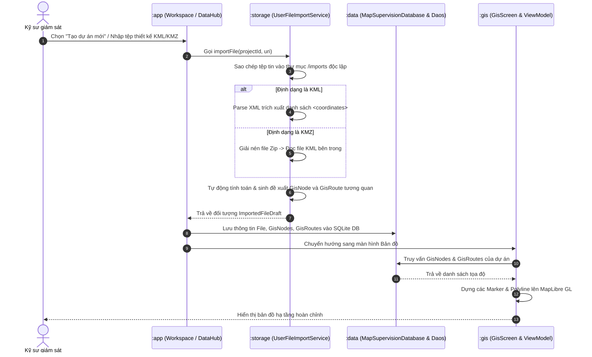
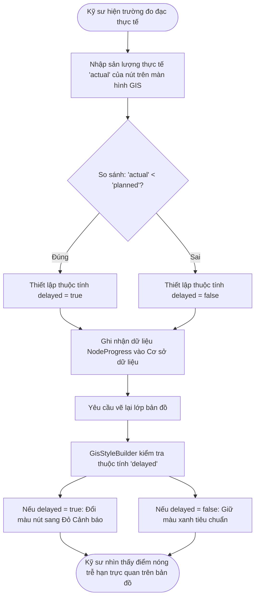
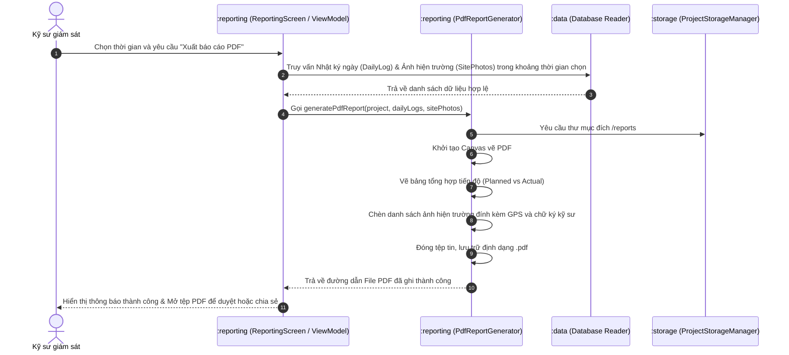

# Tổng Quan Chức Năng & Luồng Hoạt Động Hệ Thống MapSupervision

Chào mừng bạn đến với tài liệu hướng dẫn chức năng và luồng hoạt động (Workflows) của hệ thống **MapSupervision**. Tài liệu này giúp nhà phát triển và kiểm thử hiểu sâu về cách thức hoạt động thực tế của ứng dụng, từ bước khởi tạo không gian làm việc đến các luồng xử lý bất đồng bộ phức tạp bên dưới.

---

## 1. Chi Tiết Tính Năng Dự Án (Project Features)

MapSupervision là một nền tảng hỗ trợ kỹ sư giám sát dự án thi công hạ tầng diện rộng bằng bản đồ số ngoại tuyến. Hệ thống tập trung vào các tính năng cốt lõi sau:

### 1.1. Quản Lý Không Gian Làm Việc (Workspace Management)
* **Khởi tạo & cấu hình dự án**: Cho phép thiết lập tên dự án, sinh slug định danh duy nhất.
* **Cấu trúc thư mục biệt lập**: Mỗi dự án có thư mục lưu trữ độc lập trên thiết bị (`context.filesDir/MapSupervision/Projects/{projectSlug}`):
  - `db/`: Chứa cơ sở dữ liệu Room cục bộ cho từng dự án.
  - `photos/` & `thumbs/`: Lưu trữ ảnh gốc và ảnh thu nhỏ nén chất lượng cao.
  - `reports/`: Lưu trữ các tệp PDF báo cáo đã xuất bản.
  - `imports/`: Lưu trữ các file tài liệu thiết kế nguyên bản do người dùng tải lên.
* **Bảo mật**: Mã hóa dữ liệu dự án (`ProjectCryptoManager`) hỗ trợ bảo mật dữ liệu nhạy cảm trước khi đóng gói chia sẻ.

### 1.2. Bản Đồ Giám Sát Không Gian (GIS Map & Styling Engine)
* **Bản đồ Vectơ offline/online**: Sử dụng nhân MapLibre GL cùng với Compose Bridge, cho phép hiển thị các lớp bản đồ mượt mà ở tần suất khung hình cao.
* **Biểu diễn Nút kỹ thuật (GisNode)**: Trực quan hóa các điểm đặt (hố ga, trạm biến áp, mốc định vị) dưới dạng các Marker thông minh.
* **Biểu diễn Tuyến kỹ thuật (GisRoute)**: Kết nối các điểm nút thành sơ đồ tuyến hạ tầng (tuyến ống, đường dây cáp).
* **Trình dựng kiểu động (GisStyleBuilder)**: Tự động thay đổi màu sắc và độ dày hiển thị của các nút và tuyến dựa theo nhà thầu đảm nhận hoặc mức độ trễ của hạng mục thi công.

### 1.3. Nhập File Tài Liệu Thông Minh (Smart File Importer)
* **Phân tích KML/KMZ**: Trích xuất tọa độ địa lý, tự động phân tích và tạo danh sách `GisNode` và `GisRoute` tương ứng mà không cần kết nối mạng internet.
* **Đọc tài liệu phụ trợ**:
  - **Excel (.xlsx, .xls)**: Đọc thông tin tiến độ, phân tích số lượng sheet và số lượng chuỗi dùng chung (shared strings).
  - **Word (.docx, .doc)**: Trích xuất số lượng đoạn văn bản (paragraphs).
  - **PDF (.pdf)**: Ước lượng số trang và kích thước file để kỹ sư nắm bắt thông tin tài liệu đính kèm.

### 1.4. Quản Lý & Cảnh Báo Tiến Độ (Progress Tracking)
* **Chỉ số ba thành phần**: Theo dõi tiến độ Kế hoạch (`planned`), Thực tế (`actual`), và Còn lại (`remain`) theo tỷ lệ phần trăm hoặc khối lượng cụ thể.
* **Phát hiện trễ hạn tự động**: Khi tiến độ `actual` thấp hơn `planned`, hệ thống tự động gán cờ `delayed = true` và cập nhật trực quan trên bản đồ.

### 1.5. Chụp Ảnh & Nén Ảnh Hiện Trường Bằng GPS (GPS Field Photo & Background Pipeline)
* **Tự động gắn thẻ địa lý**: Ảnh chụp từ camera giám sát được tự động truy vấn GPS (`PhotoLocationProvider`), gắn tag kỹ sư và thời gian chụp chính xác.
* **Đường ống xử lý chạy ngầm (Background Pipeline)**:
  - Sử dụng **Jetpack WorkManager** (`PhotoPipelineService`) để chạy ngầm tác vụ.
  - Giảm độ phân giải ảnh gốc nhằm tiết kiệm dung lượng đĩa.
  - Tự động sinh ảnh thu nhỏ (thumbnail) kích thước nhỏ giúp tải nhanh trên giao diện bản đồ.

### 1.6. Nhật Ký & Xuất Bản Báo Cáo (Daily Log & PDF Reporting)
* **Dòng thời gian (Timeline UI)**: Tổng hợp tất cả hoạt động cập nhật tiến độ, ảnh hiện trường mới chụp theo định dạng Feed dòng thời gian trực quan.
* **Biên tập báo cáo PDF (`PdfReportGenerator`)**: Thiết kế layout báo cáo chuyên nghiệp, kết hợp bảng tiến độ và danh sách hình ảnh thực địa thành file PDF hoàn chỉnh.

---

## 2. Luồng Hoạt Động Của Dự Án (Project Workflows)

Dưới đây là mô tả chi tiết các luồng hoạt động nghiệp vụ chính xuyên suốt ứng dụng MapSupervision.

### 2.1. Luồng Khởi Tạo Dự Án & Nhập Bản Đồ Hạ Tầng (KML/KMZ Import)
Luồng này diễn ra khi kỹ sư bắt đầu một dự án giám sát mới và nhập tệp thiết kế KML/KMZ để dựng bản đồ số.

### 2.2. Luồng Giám Sát Hiện Trường, Chụp Ảnh Định Vị & Xử Lý Chạy Ngầm
Luồng này mô tả cách hệ thống xử lý ảnh chụp hiện trường không gây gián đoạn (lag) giao diện người dùng nhờ cơ chế WorkManager chạy ngầm.

```mermaid
sequenceDiagram
    autonumber
    actor Engineer as Kỹ sư giám sát
    participant PhotoUI as :photo (PhotoScreen / ViewModel)
    participant GPS as :photo (PhotoLocationProvider)
    participant Worker as :photo (PhotoPipelineService via WorkManager)
    participant StorageMgr as :storage (ProjectStorageManager)
    participant DB as :data (SitePhotoDao)
    participant GIS as :gis (Bản đồ)

    Engineer->>PhotoUI: Nhấp nút chụp ảnh hiện trạng tại nút kỹ thuật (ObjectCode)
    PhotoUI->>GPS: Yêu cầu tọa độ GPS hiện thời
    GPS-->>PhotoUI: Trả về Latitude, Longitude chính xác
    PhotoUI->>PhotoUI: Thu giữ luồng ảnh thô từ Camera
    PhotoUI->>Worker: Enqueue tiến trình xử lý ảnh chạy ngầm (chuyển URI ảnh thô & siêu dữ liệu)
    Note over PhotoUI, Worker: Kỹ sư có thể tiếp tục thao tác trên UI mà không cần chờ đợi.
    
    rect rgb(20, 30, 50)
        Note over Worker: Tiến trình chạy ngầm bắt đầu
        Worker->>StorageMgr: Yêu cầu thư mục lưu trữ /photos và /thumbs
        Worker->>Worker: Giải nén & Nén ảnh thô về kích thước tiêu chuẩn (.jpg)
        Worker->>Worker: Tạo ảnh thu nhỏ (thumbnail) kích thước nhỏ
        Worker->>DB: Ghi dữ liệu SitePhotoEntity (đường dẫn ảnh, GPS, Kỹ sư, Thời gian)
    end
    
    Worker-->>GIS: Thông báo cập nhật dữ liệu hoàn tất
    GIS->>GIS: Tải lại danh sách ảnh thu nhỏ tại nút
    GIS-->>Engineer: Hiển thị ảnh hiện trường thu nhỏ ngay trên Marker bản đồ
```

### 2.3. Luồng Cập Nhật Tiến Độ & Phát Hiện Cảnh Báo Trễ Hạn
Luồng này thực thi mỗi khi có sự thay đổi về sản lượng thi công tại hiện trường.

### 2.4. Luồng Biên Tập & Xuất Báo Cáo PDF gửi Chủ Đầu Tư
Luồng này dùng để xuất dữ liệu giám sát thành văn bản PDF chính thức để gửi báo cáo tiến độ.

---
*Tài liệu này được tạo và lưu trữ cục bộ trong thư mục tài liệu kỹ thuật của dự án MapSupervision.*
